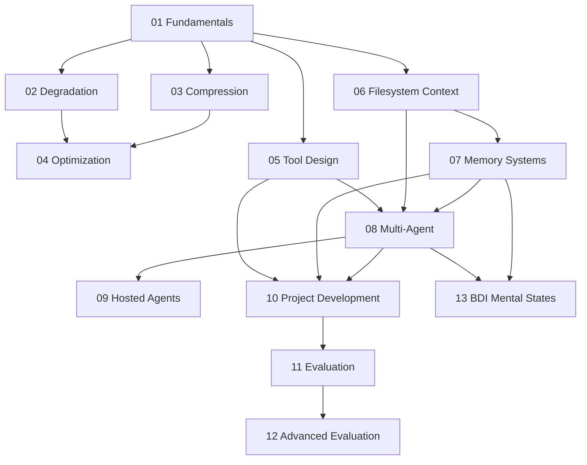

# 《Context Engineering》成书式课程总纲

## 定位

这是一套 5 部 13 章的中文教材骨架。它不按仓库目录顺序排列，而按认知依赖关系排列：

1. 先理解 context 是什么
2. 再理解 context 如何失效
3. 再学习如何压缩与优化
4. 再把这些原则落实到工具、文件、记忆、架构
5. 最后建立评估闭环，并上升到认知架构

## 全书目录

### 第一部：建立 Context Engineering 的底层认知

1. Context Engineering Fundamentals
2. Context Degradation Patterns
3. Context Compression Strategies
4. Context Optimization

### 第二部：把上下文变成可操作的工程结构

5. Tool Design for Agents
6. Filesystem Context
7. Memory Systems

### 第三部：从单 Agent 走向系统级架构

8. Multi-Agent Architecture Patterns
9. Hosted Agents
10. Project Development Methodology

### 第四部：让系统可验证、可迭代

11. Evaluation
12. Advanced Evaluation

### 第五部：认知架构与下一层抽象

13. BDI Mental State Modeling

## 章节依赖关系

## 核心教学原则

- `context-fundamentals` 是前置章，不能跳
- `context-degradation` 和 `context-compression` 要成对学习
- `filesystem-context` 是整套方法论的“工程地面层”
- `multi-agent-patterns` 的中心论点不是分工，而是隔离 context
- `hosted-agents` 不是部署附录，而是运行时上下文工程
- `evaluation` 不是最后补一个测试章节，而是反向约束前面所有设计
- `bdi-mental-states` 只放压轴，不让初学者误以为 formalism 是入门门槛

## 对应本地教材

- 原则层：`skills/*/SKILL.md`
- 脉络层：`docs/blogs.md`、`README.md`、`docs/agentskills.md`
- 例证层：`examples/digital-brain-skill`、`examples/x-to-book-system`、`examples/book-sft-pipeline`、`examples/llm-as-judge-skills`

## 成书输出要求

完成这套课程后，至少应有：

- 13 章章节初稿
- 30+ 术语表
- 12+ 设计模式卡片
- 8+ 反模式卡片
- 4 个主案例的技能映射
- 1 份设计审查清单
- 1 份完整中文书稿目录与摘要

