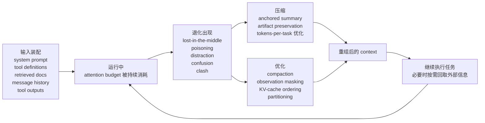

# Context 生命周期图

## 说明

- `输入装配` 对应第 1 章：context 的组成与预算
- `退化出现` 对应第 2 章：上下文为何开始失真
- `压缩` 对应第 3 章：如何保留工作连续性
- `优化` 对应第 4 章：如何提升当前上下文的信号密度
- `继续执行任务` 说明 compression 和 optimization 都不是终点，它们服务于更长的任务续航

## 本周核心判断

1. Context 不是静态文本，而是动态装配物。
2. Degradation 往往早于窗口耗尽。
3. Compression 的目标是减少任务总成本，而不是只缩短单次请求。
4. Optimization 的重点是让高价值信息更容易被模型持续利用。
