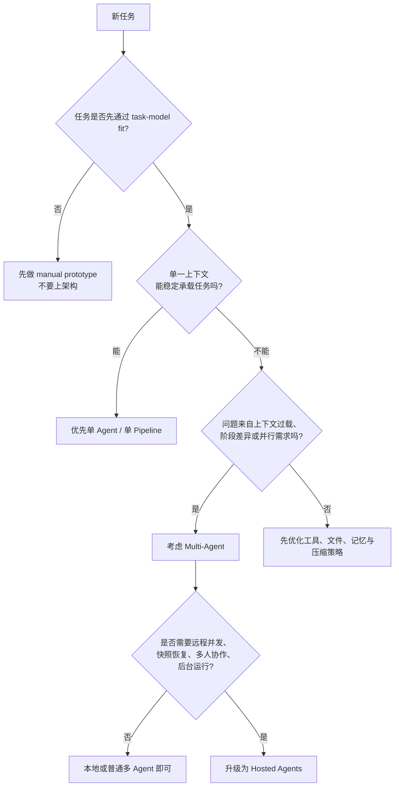

# 单 Agent / 多 Agent / Hosted Agent 决策图

## 使用说明

### 先问 task-model fit

如果连手工样本都证明模型不适合做这个任务，就不要急着讨论 agent 形态。

### 再问单上下文是否够用

如果一个 agent 在合理预算下已经能稳定完成，优先保持简单。

### 只有在上下文问题无法靠优化解决时，才升级到多 agent

触发条件通常包括：

- 子任务明显可并行
- 子任务需要不同工具集
- 原始数据量使单上下文持续退化
- 阶段之间需要强隔离

### Hosted agents 不是默认升级项

只有当你真正需要：

- 远程沙箱
- 会话快照
- 并发运行
- 自生成子会话
- 多人共享会话

才值得把系统推到 hosted runtime 层。

## 对应案例

### 单 Agent / 单 Pipeline 倾向

- `book-sft-pipeline`

原因：

- 阶段清晰
- 批处理为主
- 不强依赖实时多代理协作

### Multi-Agent 倾向

- `x-to-book-system`

原因：

- 原始数据量大
- 阶段强分离
- 需要上下文隔离和中央协调

### Hosted Agent 倾向

- 官方 `hosted-agents` skill 描述的背景 coding agents

原因：

- 长时运行
- 并发任务
- 快照恢复
- 多客户端和多人协作
