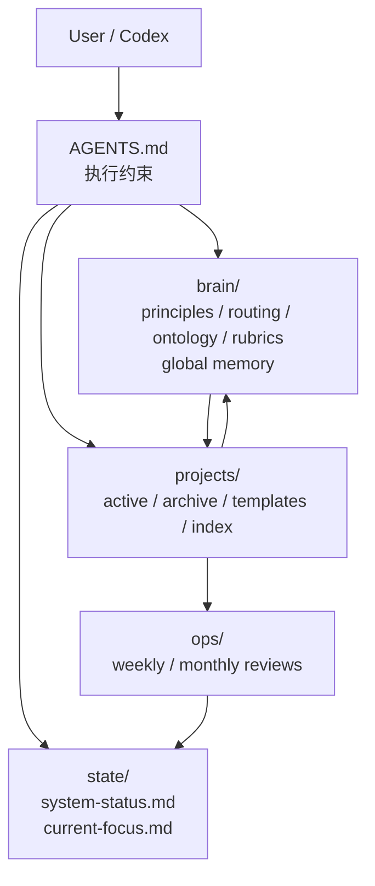
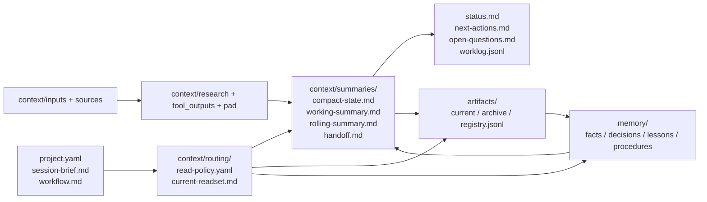
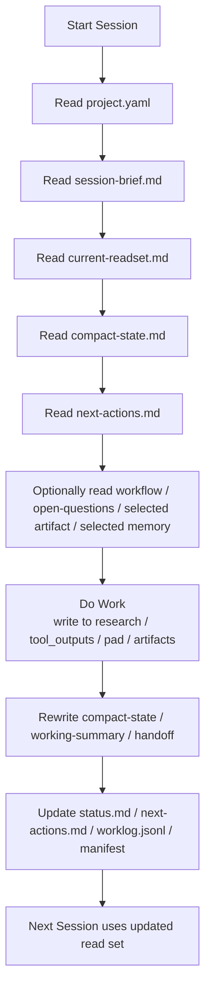

# Architecture

Second Brain OS 的核心不是“存很多文件”，而是把文件组织成一个可路由、可压缩、可交接的上下文系统。

## 架构总览图

## 单项目工作区图

## 会话启动与交接图

## 四层结构

- `state/`：系统总状态，回答“现在 OS 到哪一步了”
- `brain/`：全局规则、术语、分类、rubric、全局 memory
- `projects/`：具体项目工作区
- `ops/`：周期盘点输出

## 项目工作区的四个核心面

### 1. Routing

决定下一轮默认读什么：

- `session-brief.md`
- `context/routing/read-policy.yaml`
- `context/routing/current-readset.md`

### 2. Summaries

决定中间压缩层：

- `context/summaries/compact-state.md`
- `context/summaries/working-summary.md`
- `context/summaries/rolling-summary.md`
- `context/summaries/handoff.md`

### 3. Artifacts

决定正式成果和交接对象：

- `artifacts/current/`
- `artifacts/archive/`
- `artifacts/registry.jsonl`

### 4. Memory

决定长期结构化知识：

- `memory/facts.jsonl`
- `memory/decisions.jsonl`
- `memory/lessons.jsonl`
- `memory/procedures.jsonl`

## 项目内信息流

固定流向：

`inputs / sources -> research / tool_outputs -> summaries / artifacts -> memory -> brain memory`

## 默认读取原则

每次进入项目时，先读：

1. `project.yaml`
2. `session-brief.md`
3. `context/routing/current-readset.md`
4. `context/summaries/compact-state.md`
5. `next-actions.md`

然后再根据 `current-readset.md` 决定是否读：

- `working-summary.md`
- 某个 research note
- 某个 artifact
- 某类 memory

## 默认禁止直接注入

- 整个 `context/tool_outputs/`
- 整个 `context/inputs/`
- 整个 `context/research/`
- 整个 `artifacts/archive/`
- 任意超预算长文件

## 为什么要有中间压缩层

因为：

- `status.md` 不应该承担全部压缩职责
- 原始输入和工具输出不适合直接长期充当工作上下文
- 长任务一定会膨胀，必须有可重写的 summary 层

## 为什么要 artifact-first

因为：

- artifact 更适合交接
- artifact 更适合被多个文件引用
- artifact 能降低“同一结论在多个文件里重复拷贝”的风险

更完整的升级设计见：

- `docs/context-os-upgrade.md`
