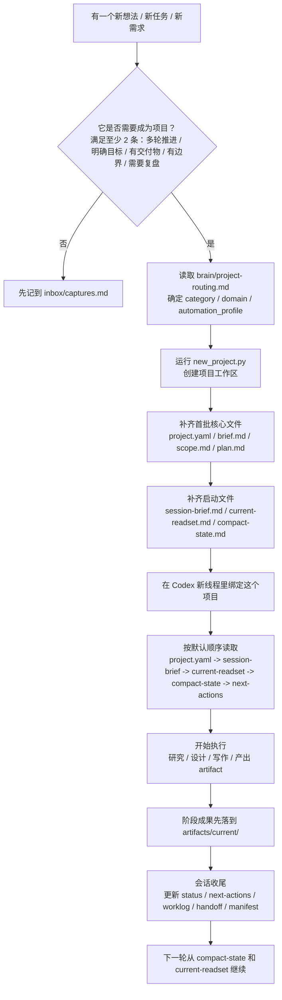

# Second Brain OS 使用手册

这份手册面向第一次使用 Second Brain OS 的人。  
目标不是教你“怎么写漂亮笔记”，而是教你：

- 怎么判断一个事情要不要建项目
- 怎么让项目适合 Codex 长期推进
- 怎么让下一轮会话能无损接上
- 怎么让 artifact 成为主产物，而不是聊天记录

## 0. 新人视角总流程图

先不要急着看所有文件。  
一个新人第一次使用 Second Brain OS，可以先记住这条主线：



这张图里最重要的不是“建目录”，而是这 4 个动作：

- 先判断要不要建项目，而不是所有事都开项目
- 项目一创建，就先写启动文件，而不是直接开始堆资料
- 做事时优先产出 artifact，而不是把结论散落在聊天和状态文档里
- 每轮结束必须留下可恢复的交接层，让下一轮能直接接上

## 1. 先理解这个系统在解决什么问题

Second Brain OS 不是一个知识库。  
它是一个 **context operating system**。

它的核心任务是四件事：

1. `select`：下一轮应该读什么
2. `compress`：长任务怎么压缩
3. `isolate`：临时内容和稳定内容怎么分开
4. `handoff`：一轮结束后怎么让下一轮直接接上

所以你在这里管理的不是“文件数量”，而是“上下文质量”。

## 2. 第一次进入时先读什么

进入 `second-brain-os/` 后，先按这个顺序读：

1. `README.md`
2. `AGENTS.md`
3. `docs/context-os-upgrade.md`
4. `state/system-status.md`
5. `state/current-focus.md`
6. `brain/project-routing.md`
7. `brain/principles.md`
8. `brain/ontology.md`

这一步的目的：

- 先知道系统当前在什么阶段
- 再知道项目怎么分类
- 再知道系统里每个对象是什么意思

## 3. 什么情况下应该建项目

满足下面任意两条，通常就应该建项目：

- 这个事情需要跨多轮会话继续推进
- 它有明确目标或交付结果
- 它有边界、风险、依赖或约束
- 它需要记录状态，而不是只收藏资料
- 以后需要复盘、归档或复用

如果不满足，先写到：

- `inbox/captures.md`

## 4. 建项目之前，必须先做的 4 个判断

### 4.1 先判断 `category`

`category` 是执行模式，不是行业。

- `research`
- `build`
- `operations`
- `writing`
- `delivery`
- `learning`

### 4.2 再判断 `domain`

- `work`
- `startup`
- `personal`
- `learning`
- `other`

### 4.3 再判断 `automation_profile`

- `manual`
- `assisted`
- `delegated`

### 4.4 再判断主 artifact 会是什么

开项目之前先问自己：

- 这个项目的第一阶段主产物是什么？

例如：

- `research`：research memo / comparison matrix
- `build`：spec / architecture note / prototype result
- `operations`：runbook / checklist / review note
- `writing`：outline / draft / final copy

如果你连主 artifact 都答不出来，说明项目目标还没清。

## 5. 怎么创建一个新项目

在 `second-brain-os/` 根目录运行：

```bash
python agents/scripts/new_project.py \
  --title "内部 AI 周报助手" \
  --slug internal-ai-weekly \
  --category build \
  --domain work \
  --automation-profile assisted \
  --priority P1 \
  --owner guapi
```

创建后会自动生成：

- 项目元数据文件
- 启动导航文件
- routing 规则文件
- summaries 压缩层
- artifacts registry
- memory 文件

## 6. 项目建好后，第一轮先填什么

不要一建好就直接开干。  
第一轮先把这些补完：

### 6.1 `project.yaml`

这是项目元数据入口。

你至少要补：

- `objective`
- `success_criteria`
- `stakeholder`
- `current_phase`
- `primary_artifact`
- `tags`

### 6.2 `brief.md`

回答：

- 这个项目为什么存在
- 想解决什么问题
- 成功标准是什么
- 服务对象是谁

### 6.3 `scope.md`

回答：

- 做什么
- 不做什么
- 主要假设
- 主要风险
- 依赖什么

### 6.4 `plan.md`

回答：

- 分几个阶段
- 每个阶段的主 artifact 是什么
- 哪些地方是决策点

### 6.5 `session-brief.md`

这是项目驾驶舱首页。

它应该写清：

- 当前阶段
- 当前模式
- mandatory read
- optional read
- forbidden direct read
- 当前最大风险

### 6.6 `context/routing/current-readset.md`

这是最关键的新文件之一。

它的作用是：

- 告诉下一轮“现在真正该读什么”
- 避免 Codex 每轮都自己猜

它应该只保留：

- 本轮必读
- 本轮可选读
- 被点名的 research / artifact / memory
- 不应直接读的内容

### 6.7 `context/summaries/compact-state.md`

这是第二个最关键的新文件。

它的作用是：

- 给下一轮会话一个可直接注入的压缩状态

它必须短、必须重写、不能无限追加。

建议只写：

- 当前目标
- 当前阶段
- 激活中的事实
- 激活中的决策
- 当前主 artifact
- 最近 3 个动作
- 当前阻塞

## 7. 项目目录里每个区域怎么用

### 7.1 `context/inputs/`

放原始输入：

- 用户要求
- 会议记录
- 截图说明
- 附件说明

这里是“原料区”，不是工作上下文本体。

### 7.2 `context/sources/`

放可信来源：

- 固定链接
- 内部文档
- 标准资料
- 外部权威参考

如果来源很长，不要默认全文读。

### 7.3 `context/research/`

放处理过的研究笔记和分析 note。

注意：

- research note 不是默认 artifact
- research note 不是默认必读
- 只有被 `current-readset.md` 点名时才读

### 7.4 `context/tool_outputs/`

放长工具输出：

- 搜索结果
- 命令输出
- 抓取结果
- 日志

默认规则：

- 不允许整目录直接注入
- 不允许默认整份读取
- 先 summary，再 targeted excerpt

### 7.5 `context/pad/`

放临时推演：

- 临时结构
- 草稿
- 未定案判断
- 中间思路

这里不是长期仓库。  
每轮结束必须处理。

### 7.6 `context/routing/`

这里是路由层。

- `read-policy.yaml`：项目类型默认规则
- `current-readset.md`：当前这一轮真实读取规则

### 7.7 `context/summaries/`

这里是压缩层。

- `compact-state.md`：机器优先压缩状态
- `working-summary.md`：当前阶段中层压缩
- `rolling-summary.md`：多轮滚动压缩
- `handoff.md`：交接页

### 7.8 `artifacts/`

这里是正式成果区。

- `current/`：当前有效 artifact
- `archive/`：旧 artifact
- `registry.jsonl`：唯一索引

系统里最重要的原则之一：

**阶段成果先写成 artifact，再让别的文件引用它。**

### 7.9 `memory/`

这里不是资料库，而是长期结构化知识层。

- `facts.jsonl`
- `decisions.jsonl`
- `lessons.jsonl`
- `procedures.jsonl`

## 8. 一个项目启动时，Codex 默认该读什么

进入一个项目时，默认先读：

1. `project.yaml`
2. `session-brief.md`
3. `context/routing/current-readset.md`
4. `context/summaries/compact-state.md`
5. `next-actions.md`
6. `workflow.md`
7. `context/summaries/handoff.md`

这叫 **mandatory read set**。

## 9. 哪些内容不要直接读

默认禁止整份直接读：

- 整个 `context/tool_outputs/`
- 整个 `context/inputs/`
- 整个 `context/research/`
- 整个 `artifacts/archive/`
- 任意超过预算的长文件

当前默认预算：

- 单文件超过 `160` 行
- 或超过 `8 KB`

就应先读摘要，再决定是否读原文。

## 10. 什么是 working summary、rolling summary、compact state

很多人会把所有压缩都塞进 `status.md`。  
这个系统明确不这么做。

### `compact-state.md`

作用：

- 下一轮启动必读
- 最短、最硬的机器上下文

更新规则：

- 每次有实质变化就重写

### `working-summary.md`

作用：

- 当前阶段的中层压缩
- 比 compact state 更丰富

更新规则：

- 当前阶段明显变化时重写

### `rolling-summary.md`

作用：

- 项目到目前为止的压缩历史

更新规则：

- 每 3-5 轮重写一次
- 或超预算时重写

### `status.md`

作用：

- 给人看的项目仪表盘

它不负责承担全部压缩。

## 11. 什么时候要写 artifact，而不是继续写状态文档

满足下面任意两条，就应该写成 artifact：

- 这是阶段成果
- 这会被后续多次引用
- 这需要交给下一轮继续加工
- 这已经是一个正式结论或正式草稿

例如：

- `build` 项目的 architecture note
- `research` 项目的 comparison matrix
- `operations` 项目的 runbook
- `writing` 项目的 outline / draft

## 12. artifact 应该怎么管理

### 12.1 存放位置

- 当前版本：`artifacts/current/`
- 旧版本：`artifacts/archive/`

### 12.2 必须登记

每个 artifact 都应在：

- `artifacts/registry.jsonl`

里登记。

### 12.3 其他文件怎么引用 artifact

- `status.md` 只写路径和摘要
- `compact-state.md` 只写当前主 artifact
- `handoff.md` 优先交接 artifact
- 不要把 artifact 内容复制到多个文件里

## 13. memory 应该怎么写

### 13.1 `facts.jsonl`

写稳定事实，例如：

- 数据源数量已经确定为 3 个
- 外部敏感 API 不允许接入

### 13.2 `decisions.jsonl`

写关键取舍，例如：

- 第一版只做草稿，不做自动发送

### 13.3 `lessons.jsonl`

写教训，例如：

- 模板未稳定前不要过早自动化

### 13.4 `procedures.jsonl`

写重复可复用的流程，例如：

- build 类型项目默认先做 scope，再做 spec，再做 prototype artifact

如果一个做法未来还会重复用，就不该只存在于聊天里。

## 14. 每次会话结束时必须做什么

会话结束前，至少做下面 6 件事：

1. 更新 `next-actions.md`
2. 更新 `context/routing/current-readset.md`
3. 更新 `context/summaries/compact-state.md`
4. 更新 `context/summaries/handoff.md`
5. 追加 `worklog.jsonl`
6. 写一条 `context/manifests/*.jsonl`

如果这一轮产出了阶段成果，再额外做两件事：

7. 写 artifact 到 `artifacts/current/`
8. 在 `artifacts/registry.jsonl` 里登记

## 15. `pad/` 结束时怎么清理

`pad/` 里的每个文件必须进入四种结果之一：

1. 删除
2. 保留为 working note
3. 提升到 `context/research/`
4. 提升到 `memory/`

不允许无限期留一堆“以后再看”的草稿。

## 16. 会话关闭时可以用什么命令

```bash
python agents/scripts/close_session.py \
  --project projects/active/internal-ai-weekly \
  --goal "完成第一轮项目初始化" \
  --summary "已补齐项目目标、范围和当前 read set。" \
  --carry-forward "下一轮先产出 architecture note artifact。" \
  --files-read project.yaml,session-brief.md,context/routing/current-readset.md \
  --files-written next-actions.md,context/summaries/compact-state.md,context/summaries/handoff.md \
  --artifact-refs art_001
```

它会帮你：

- 写 manifest
- 写 worklog
- 提醒你 `pad/` 是否没清理

## 17. 每周怎么盘点

运行：

```bash
python agents/scripts/review_projects.py
```

它会在 `ops/weekly/` 生成周盘点，帮助你看：

- 当前有哪些活跃项目
- 当前阶段分别是什么
- 当前主 artifact 是什么
- 每个项目下一步是什么

## 18. 在 Codex 里怎么开绑定项目的新线程

不要把 workspace 直接开在某个项目目录。  
正确做法：

1. workspace 固定在 `second-brain-os/`
2. 新开线程
3. 第一条消息明确绑定项目目录
4. 让 Codex 先读 mandatory read set

直接用：

- `docs/codex-thread-template.md`

## 19. 一个完整示例

项目：内部 AI 周报助手

### 分类

- `category = build`
- `domain = work`
- `automation_profile = assisted`

### 第一阶段主 artifact

- architecture note

### 第一轮应该补什么

- `project.yaml`
- `brief.md`
- `scope.md`
- `plan.md`
- `session-brief.md`
- `context/routing/current-readset.md`
- `context/summaries/compact-state.md`

### 第一轮结束时至少产出什么

- 明确目标
- 明确边界
- 明确第一批 next actions
- 明确第一阶段 artifact 目标
- 更新 handoff

## 20. 你最该记住的一句话

Second Brain OS 的核心不是“把信息都存下来”，而是：

**让正确的信息，在下一轮，以最小成本，被正确读回来。**


21. 对于单项目的文档逻辑：

    • 原始资料、你现有的笔记、别人给你的文档：放到 context/inputs

    • 官方资料、白皮书、网页导出、截图等“可当来源”的东西：放到 context/sources

    • 很长的抓取结果、网页转存、转录、批量导出：放到 context/tool_outputs

    • 你已经整理过一轮的研究笔记：放到 context/research
